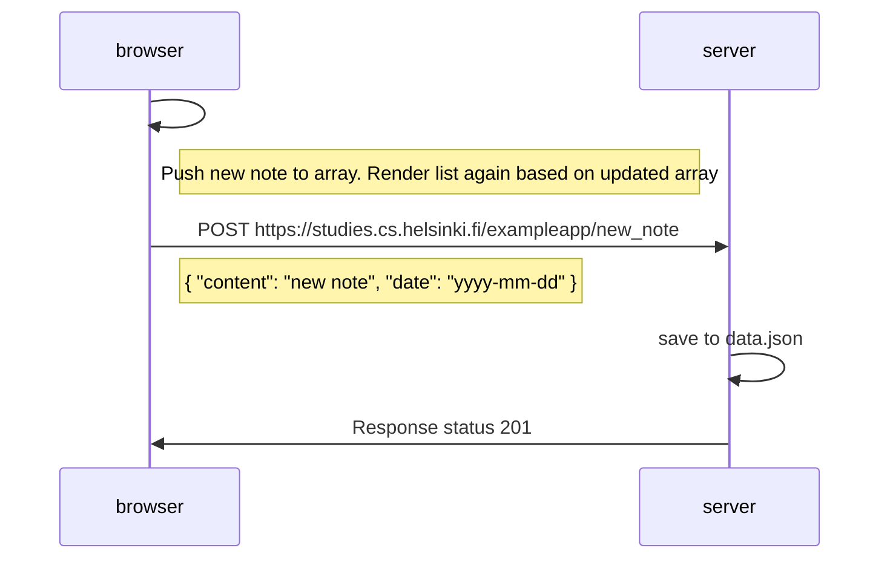

```mermaid
sequenceDiagram
    participant browser
    participant server

    browser->>browser: 
    Note right of browser: Push new note to array. Render list again based on updated array

    browser->>server: POST https://studies.cs.helsinki.fi/exampleapp/new_note
    Note right of browser: { "content": "new note", "date": "yyyy-mm-dd" }

    server->>server: save to data.json
    server->>browser: Response status 201

```